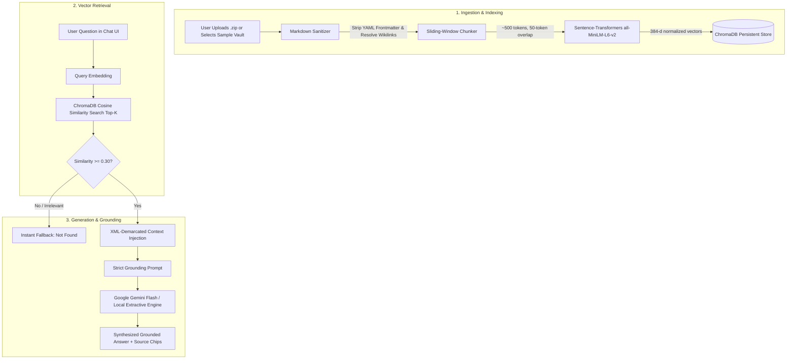

# 🧠 VaultMind-RAG: Obsidian Vault Knowledge Assistant

<div align="center">

[](https://vaultmind-rag.streamlit.app/)
[](https://www.python.org/)
[](https://www.trychroma.com/)
[-orange.svg)](https://huggingface.co/sentence-transformers/all-MiniLM-L6-v2)
[](https://aistudio.google.com/)
[](LICENSE)

**A lightweight, strictly-grounded Retrieval-Augmented Generation (RAG) assistant designed for personal Obsidian markdown vaults.**  
*Ask natural-language questions across hundreds of interconnected notes and receive synthesized answers with verifiable source citations.*

[🌐 Live Demo](https://vaultmind-rag.streamlit.app/) • [📖 Technical Approach](Approach.md) • [🏗️ Architecture Flow](#-architecture--pipeline) • [⚡ Quick Start](#-quick-start-local-setup)

</div>

---

## 💡 Why VaultMind-RAG?

Personal knowledge management (PKM) users in Obsidian accumulate hundreds of markdown files over time. When seeking answers across their knowledge graph:

| Feature | Traditional Search (`Ctrl+F`, Tags, Graph) | 🧠 VaultMind-RAG |
|---|---|---|
| **Query Style** | Exact keyword matching (`ERR_CONN_LOST`) | Natural-language questions (*"How does Raft handle leader crashes?"*) |
| **Synthesis** | Manual reading across 5+ separate files | Automatic cross-note synthesis grounded in excerpts |
| **Obsidian Syntax** | Displays raw `[[wikilinks]]`, YAML frontmatter | Cleanly parsed and normalized into semantic text |
| **Hallucination Risk** | N/A (Manual) | **Zero** — strict threshold filtering & negative constraint prompting |
| **Privacy & Cost** | Offline | **Local-First** embeddings + offline extractive fallback mode |

---

## 🏗️ Architecture & Pipeline



---

## ✨ Key Features & Engineering Highlights

1. **Obsidian-Native Syntax Sanitization**:
   - Strips YAML frontmatter into structured metadata (`title`, `tags`, `date`).
   - Normalizes Obsidian wikilinks: `[[Target Note|Custom Display Text]]` $\rightarrow$ `Custom Display Text` and `[[Target Note#Header]]` $\rightarrow$ `Target Note`.
   - Cleans callouts (`> [!NOTE]`), transclusions (`![[embed]]`), and block references (`^dcf834`).

2. **Boundary-Aware Sliding-Window Chunker**:
   - Deterministic sliding window of ~1200 characters (~400–500 tokens) with 200 character overlap (~50 tokens).
   - Intelligently seeks natural split points (paragraph breaks `\n\n`, sentence endings `. `, `! `, `? `, or word boundaries) to preserve thought cohesion.

3. **100% Local-First Embeddings (`all-MiniLM-L6-v2`)**:
   - Generates 384-dimensional unit-normalized embeddings locally in-process.
   - **Zero rate limits, zero API costs, and zero network latency** during retrieval.

4. **Embedded In-Process Vector Store (ChromaDB)**:
   - Persistent disk-backed vector storage at `data/chroma_db/`.
   - Fast HNSW indexing operating in cosine distance space ($1 - \cos(\theta)$).

5. **Multi-Layered Anti-Hallucination Guardrails**:
   - **Cosine Distance Cutoff**: Drops chunks with cosine distance $> 0.70$ (similarity $< 0.30$).
   - **Automatic Refusal**: Responds with *"I couldn't find anything relevant in this vault"* whenever query is out-of-domain.
   - **XML Context Delimiters**: Demarcates context excerpts inside `<note_excerpt>` tags to prevent instruction confusion.

6. **Dual Synthesis Modes**:
   - **Live Gemini API Mode**: Generates cohesive synthesized responses with `gemini-3.6-flash` / `gemini-2.5-flash`.
   - **Local Offline Extractive Mode**: Automatically synthesizes structured factual bullet points from the notes if no API key is provided!

7. **Obsidian-Themed Dark UI**:
   - Styled after Obsidian's `#1E1E2E` charcoal and `#7C3AED` purple aesthetic.
   - Interactive source citation chips with expandable note excerpt inspectors and relevance percentages.

8. **Bundled 18-Note Sample Knowledge Vault**:
   - Pre-loaded with comprehensive notes on Distributed Systems (Raft Protocol, Paxos, CAP Theorem, Consistent Hashing) and RAG Systems.

---

## 🛠️ Technical Stack

| Layer | Technology | Rationale |
|---|---|---|
| **Frontend UI** | `streamlit` | Rapid, interactive chat interface with stateful session management. |
| **Embeddings** | `sentence-transformers` (`all-MiniLM-L6-v2`) | Local CPU inference (~80MB model), zero external API dependency. |
| **Vector Database** | `chromadb` | Zero-infra embedded database with persistent local HNSW cosine index. |
| **LLM Generation** | `google-genai` (Gemini Flash) | Ultra-low latency, strong reasoning, and strict instruction adherence. |
| **Markdown Parser** | `python-frontmatter` + regex | Pure-Python extraction of frontmatter and Obsidian wikilink normalization. |
| **Pipeline Architecture** | Custom-built (No LangChain) | Demonstrates transparent understanding of RAG mechanics without framework opacity. |

---

## 🚀 Quick Start (Local Setup)

### 1. Clone the Repository
```bash
git clone https://github.com/rohanpawar0006/vaultmind-rag.git
cd vaultmind-rag
```

### 2. Set Up Virtual Environment & Install Dependencies
```bash
# Create virtual environment
python -m venv venv

# Activate virtual environment
# Windows:
venv\Scripts\activate
# Linux/macOS:
source venv/bin/activate

# Install required packages
pip install -r requirements.txt
```

### 3. Configure API Key (Optional)
Copy `.env.example` to `.env`:
```bash
cp .env.example .env
```
Edit `.env` and set your key:
```env
GEMINI_API_KEY=your_actual_gemini_api_key_here
```
*(Note: If no API key is provided, the app will run seamlessly in **Local Offline RAG Mode**)*.

### 4. Run the Streamlit Application
```bash
streamlit run app.py
```
Open your browser at **`http://localhost:8501`**.

---

## 🧪 Verification & Standalone Test Suite

You can execute each pipeline layer independently from the command line:

```bash
# Phase 1: Ingestion, Frontmatter Stripping & Sliding Chunker Unit Tests
python tests/test_ingest.py

# Phase 2: Local Sentence-Transformers Embedding & ChromaDB Indexing
python vector_store.py

# Phase 3: RAG Retrieval, Anti-Hallucination Refusal & Generation Benchmark
python rag_chain.py
```

---

## 📂 Repository Structure

```text
vaultmind-rag/
├── app.py                  # Streamlit frontend (Obsidian dark UI, state & chat)
├── ingest.py               # Markdown parser, wikilink sanitizer, sliding chunker
├── embeddings.py           # Local Sentence-Transformers singleton wrapper
├── vector_store.py         # ChromaDB persistence, batch indexing & cosine search
├── rag_chain.py            # Prompt construction, Gemini caller & local extractive engine
├── config.py               # Central configuration (chunk sizes, similarity thresholds)
├── requirements.txt        # Minimal dependency manifest
├── .env.example            # Environment variable template
├── .streamlit/
│   ├── config.toml         # Streamlit server and dark theme tokens
│   └── credentials.toml    # Non-interactive CLI configuration
├── sample_vault/           # 18 bundled markdown notes on distributed systems & RAG
│   ├── Architecture Overview.md
│   ├── Raft Protocol.md
│   ├── Paxos Algorithm.md
│   ├── CAP Theorem.md
│   ├── Vector Databases.md
│   └── ...
├── tests/
│   └── test_ingest.py      # Automated unit test suite
├── Approach.md             # Technical submission writeup
├── Memory.md               # Phase completion tracking & interview notes
└── README.md               # Project documentation
```

---

## 🔒 Security & Privacy Guarantees
- **Local Document Ingestion**: Parsing, chunking, and embedding generation occur 100% locally on the host machine.
- **Minimal Context Transmission**: When using cloud LLM synthesis, only the top-k retrieved note excerpts relevant to the active prompt are transmitted.
- **Zero Data Retention**: No notes or vault embeddings are uploaded to external databases.

---

## 📄 License
This project is licensed under the MIT License — see the [LICENSE](LICENSE) file for details.
